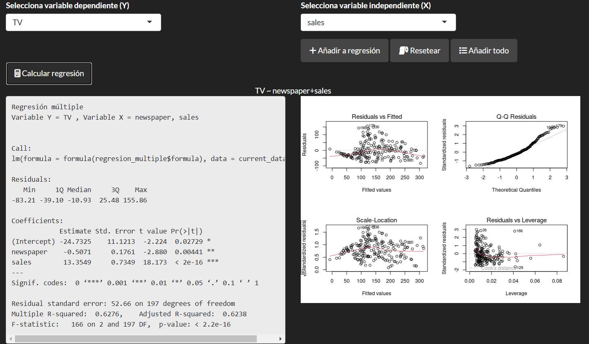

# 🌐 **Making a web page with Shiny (R)** 💻

Shiny is an R package that allows to translate R language to HTML, CSS and JavaScript. This way, it's possible to build a web page using only R, that was then uploaded into [shinyapps.io](https://www.shinyapps.io/). To access the final result, you can follow this [link to my web page](https://domingopc.shinyapps.io/DomingoPC__Entrega_Shiny/).

---

## 🎯 Objectives
- Make a replica of the [professor's web page](https://shinyg.destio.synology.me/apps/cDSBI/Entrega01/).
- Add new functionalities.
- Comments on a different Shiny App.
- Comments on a Shiny library not seen in class.

---

## 🛠️ New Functionalities
- Web page theme (see button below the title):
  - Changed theme in comparison to the professor's page.
  - Change between light and dark themes (library shinyjs).

  
- Redesigned:
  - The navigation table (at the left), the font as wel as the background colour of the selected category were changed.
  - On the data table, under _Datos_ section, the header was modified.

- Data analysis (_Estudio Descriptivo_ section):
  - Added Pearson's correlation.
  - Added multiple linear regression, which showcases:
    - Formula construction with buttons.
    - Statistical summary of the chosen model.
    - It avoids using the same variable multiple times.
    - It avoud using the target variable as an explainatory variable.

---

## 📓 Comments on a Different Shiny App
On [Shiny for R Gallery](https://shiny.posit.co/r/gallery/) there are several Shiny apps to be used as reference. One of them is the [Simple Word Count](https://shiny.posit.co/r/gallery/start-simple/word-cloud/), designed to read a document and make a visual representation of the most frequently used words.

One of the reason why this page was chosen, is that it uses the file **global.R**, which saves information accesible by the server and the ui part of the Shiny app. This was used to:
- Save the path to the text files to use as an example.
- Save the function that calculates word frequency.
- Save the function that orders the words by number of appearances.

On the other hand, on the server part of the Shiny app, the _wordcloud_ function was used to create the visual representation.

---

## 📚 Comments on a Shiny Library
The library **shinycssloaders** allows to include loading animations. This is a simple change but, in Shiny, which is usually used to compute data in real time, is bound to appear several times.

